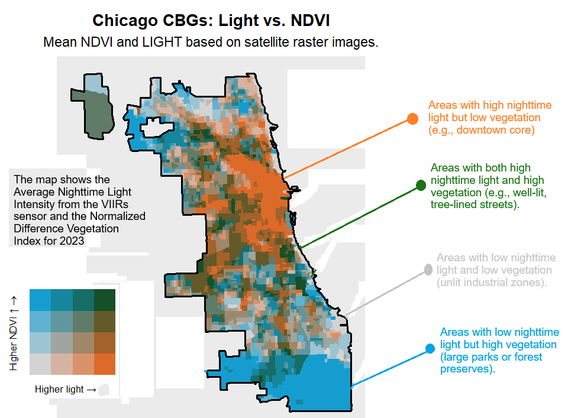

# Spatiotemporal Modeling of Overdose Risk in Cook County, Illinois (2020–2023)

This repository contains the full analysis pipeline used for the manuscript:

**[Under Review]**  
*An assessment of overdose mortality risk across the urban–rural continuum: Integrating satellite-derived and socioeconomic indicators*  
Submitted to the *Journal of Urban Health*.

---

## Overview

This project examines the spatial and temporal distribution of fatal overdose risk across census block groups (CBGs) in Cook County, Illinois, from 2020 to 2023. We integrate medical examiner data with satellite-derived environmental indicators, urban form classifications, and social deprivation indices to model relative risk and identify high-risk trends.

---

## Workflow Summary

### 1. Setup and Data Acquisition

- **Load required packages**: `sf`, `terra`, `tigris`, `tidycensus`, `CARBayesST`, `ggplot2`, `biscale`, and others.
- **Import core datasets**:
  - Cook County CBG boundaries
  - ACS population estimates (2020–2023)
  - Green space access (park acres per CBG)
  - Medical examiner overdose fatality data
  - Built environment intensity and nighttime light rasters (from remote sensing)
  - Urban classification raster from GHS-SMOD (mosaicked and extracted by modal class)

### 2. Data Wrangling and Feature Engineering

- Join overdose incidents to CBGs and compute annual fatality counts.
- Merge ACS and green space data with each CBG.
- Extract satellite imagery metrics per CBG:
  - **Built environment intensity** (median)
  - **Nighttime light** (median)
  - **NDVI** (greenness index from Landsat)
- Integrate **Area Deprivation Index (ADI)** using `sociome::get_adi()`.

### 3. Statistical Modeling

- Fit Poisson GLMs using:
  - Park access, urban classification, and ADI (continuous and quintile versions)
- Create a long panel dataset for 2020–2023 overdose counts.
- Fit a **spatiotemporal Bayesian Poisson model** (`ST.CARar`) using `CARBayesST`:
  - Includes spatial adjacency matrix for CBGs
  - Year-centered trend, park access, greenness, ADI quintile, built-up area, and light intensity
- Calculate fitted values and relative risk (RR) by CBG and year.

### 4. Visualization

- Generate static and faceted maps of RR using `ggplot2` and `sf`
- Identify **high-risk areas** where RR > 1.5
- Plot **temporal RR trends** and **observed overdose counts** from 2020–2023
- Create **bivariate maps** (e.g., ADI × light intensity) using `biscale` and `cowplot`
- Classify CBGs by **trend type**: increasing, decreasing, sharply increasing, or stable risk
- Visualize trend classification across urban form categories

---

## Outputs

- Modeled overdose relative risk maps (2020–2023)
- High-risk area identification and classification
- GLM and CAR model summaries
- NDVI, urban form, and light intensity integration
- Trend slope and curvature maps
- Aggregated trends by urban classification

---

## Directory Structure

**Note**: Will be finalized after publication. The code can be located in scripts/analysis.R but to replicate you will need to download the following datasets.

## Data Sources

| Data Source                              | Description                                                         | Access / URL                                                                                   |
|-----------------------------------------|---------------------------------------------------------------------|-------------------------------------------------------------------------------------------------|
| Cook County Medical Examiner Archive    | Geocoded fatal overdose records (2018–2023)                         | [Cook County Medical Examiner](https://data.cookcountyil.gov)                                  |
| American Community Survey (ACS)         | Population estimates at block group level (2020–2023)               | [tidycensus R package](https://walker-data.com/tidycensus/index.html)                          |
| GHS-SMOD                                | Degree of Urbanization classification raster                        | [European Commission JRC](https://ghsl.jrc.ec.europa.eu/download.php)                          |
| Built-Up Area Raster                    | Impervious surface density raster (100m)                            | [Global Human Settlement Layer (GHS-BUILT)](https://ghsl.jrc.ec.europa.eu/download.php)         |
| Nighttime Lights (VIIRS)                | Nighttime light emissions                                           | [NASA Earth Data](https://earthdata.nasa.gov) or [NOAA VIIRS](https://ngdc.noaa.gov/eog/)      |
| Landsat Surface Reflectance             | Red and NIR bands used to compute NDVI                              | [USGS EarthExplorer](https://earthexplorer.usgs.gov)                                           |
| Park Access (WEDAM)                     | Acres of green space per CBG in Chicago                             | [Chicago Health Atlas](https://www.chicagohealthatlas.org/)                                    |
| Area Deprivation Index (ADI)            | Socioeconomic vulnerability index at the block group level          | [sociome R package](https://github.com/hrbrmstr/sociome)                                       |
| TIGER/Line CBG Shapefiles               | Census Block Group geometries for Cook County, IL                   | [tigris R package](https://cran.r-project.org/web/packages/tigris/index.html)                  |

📄 README.md
